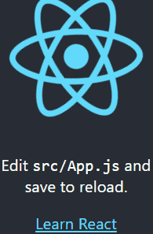

# react-seamless-scroll

>一个基于 `requestAnimationFrame` 的`react`自动无缝滚动组件！



## 快速开始

---

- `npm install react-seamless-scroll -S`
- `import react-seamless-scroll from 'react-seamless-scroll'`;

## 使用方法

---

如下props:

Option               | default       | Description
---------------------|---------------|-----------------------------------------------
`speed`            |  60        | 每秒/px
`reverse`   |  false         | 是否逆向滚动
`mode`            |  vertical         | 滚动方向

## 示例代码

```typescript
import './index.scss';

import {Icon, Spin} from 'antd';

import React from 'react';
import ReactSeamlessScroll from 'react-seamless-scroll';
import moment from 'moment';

interface IProps {}
const Broadcast = React.memo((props: IProps) => {
  return (
    <ReactSeamlessScroll style={{width: '200px', height: '300px'}}>
      <header className="App-header">
        
        <p>
          Edit <code>src/App.js</code> and save to reload.
        </p>
        <a
          className="App-link"
          href="https://reactjs.org"
          target="_blank"
          rel="noopener noreferrer"
        >
          Learn React
        </a>
      </header>
    </ReactSeamlessScroll>
  );
});

export default Broadcast;

```
